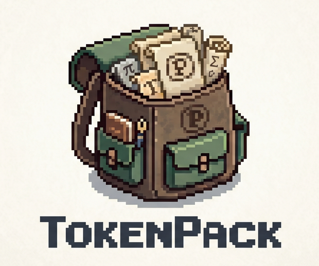

<p align="center">
  
</p>

<h1 align="center">TokenPack-RAG</h1>

<p align="center">
  <strong>Turn long files into compact, evidence-dense LLM context.</strong>
</p>

<p align="center">
  <a href="https://pypi.org/project/tokenpack-rag/"></a>
  <a href="https://pypi.org/project/tokenpack-rag/"></a>
  <a href="https://github.com/mo-tunn/TokenPack/actions/workflows/tests.yml"></a>
  
  <a href="https://pypi.org/project/tokenpack-rag/"></a>
  
  
  
</p>

TokenPack-RAG selects the most useful chunks from documents, code, PDFs, tables, and folders under a strict token budget. It does **not** call an LLM during packing: it runs local embeddings, evidence scoring, and budget-aware selection, then writes a Markdown context file you can give to any LLM or agent.

```text
structure-aware semantic chunks + evidence-hybrid scoring + hybrid-greedy packing
```

<p align="center">
  
</p>

## Why Use It

Long-context LLMs make it tempting to paste everything into the prompt. In practice, that is expensive, slow, and often noisy. Naive RAG has the opposite problem: top-k retrieval can collect locally relevant chunks while missing the best global use of a fixed token budget.

TokenPack-RAG is built for that middle layer:

- Turns a file or folder into a compact, LLM-ready context file with one command.
- Selects globally useful evidence under a token budget instead of blindly taking top-k chunks.
- Reduces redundant or low-utility context before it reaches the LLM.
- Helps agents work with large local workspaces through MCP without uploading everything.
- Supports broad real-world inputs: docs, code, PDFs, HTML, CSV/JSON, and Office files.
- Can optionally run LLMLingua / LongLLMLingua after evidence selection for extra compression.

## Install

Basic install:

```bash
pip install tokenpack-rag
```

Recommended document install:

```bash
pip install "tokenpack-rag[pdf,office,tokens]"
```

Agent/MCP install:

```bash
pip install "tokenpack-rag[mcp,pdf,office,tokens]"
```

Development install:

```bash
git clone https://github.com/mo-tunn/TokenPack.git
cd TokenPack
pip install -e ".[pdf,office,tokens,compression,mcp,dev]"
```

TokenPack-RAG uses `sentence-transformers/all-MiniLM-L6-v2` as the default embedding model.

## 30-Second Start

Pack one document:

```bash
tokenpack-rag pack paper.pdf --query "What are the main contributions?"
```

This writes:

```text
paper-tp.md
```

Pack a folder:

```bash
tokenpack-rag pack docs/ --query "Summarize the design decisions in this project."
```

This writes:

```text
docs-tp.md
```

Choose your own budget:

```bash
tokenpack-rag pack paper.pdf \
  --query "What evidence supports the main claim?" \
  --budget 32000 \
  --overwrite
```

The output is a packed Markdown context file, not a modified PDF. You can paste it into a chat model, upload it to your own LLM workflow, or let an agent read it through MCP.

## Results Snapshot

<p align="center">
  
</p>

<details>
<summary>Technical result details behind the summary</summary>

| Setting | Technical Result |
|---|---|
| Relevant evidence kept | TokenPack preserves 93.4% of QASPER evidence vs 71.3% for compression-only. |
| All required evidence kept | TokenPack keeps complete evidence for 87.0% of QASPER questions vs 12.0% for compression-only. |
| Selection + compression | TokenPack + LLMLingua-2 reaches 58.4% context saving while keeping 85.1% of required evidence. |
| Pilot answer accuracy | On an 83-case LongBench v2 pilot, TokenPack improves relative accuracy by 15.6% over full-context prompting while saving 50.6% context. |
| Aggressive cascade | TokenPack + LongLLMLingua keeps the same pilot accuracy while reaching 74.6% context saving. |

</details>

The practical takeaway: pack the useful evidence first, then optionally compress it. This is different from blindly compressing the whole retrieved context.

## Use With Agents / MCP

Run TokenPack-RAG as a local stdio MCP server:

```bash
tokenpack-rag-mcp --workspace /path/to/project
```

Example MCP config:

```json
{
  "mcpServers": {
    "tokenpack-rag": {
      "command": "tokenpack-rag-mcp",
      "args": ["--workspace", "/path/to/project"]
    }
  }
}
```

Or use `uvx` without a permanent install:

```json
{
  "mcpServers": {
    "tokenpack-rag": {
      "command": "uvx",
      "args": [
        "--from",
        "tokenpack-rag[mcp,pdf,office,tokens]",
        "tokenpack-rag-mcp",
        "--workspace",
        "/path/to/project"
      ]
    }
  }
}
```

MCP tools:

| Tool | Purpose |
|---|---|
| `pack_context` | Packs a file or folder into Markdown context and writes the `-tp.md` artifact. |
| `read_packed_context` | Reads a packed context artifact, optionally in slices for large files. |

By default the MCP server can only read and write inside `--workspace`. Use `--allow-any-path` only for trusted local setups.

## Supported Inputs

TokenPack-RAG accepts a single file or a folder. Folder inputs are scanned recursively and unsupported binary/media files are skipped.

| Category | Extensions |
|---|---|
| Text and docs | `.txt`, `.text`, `.md`, `.markdown`, `.rst`, `.adoc`, `.tex`, `.log` |
| PDF | `.pdf` with the `pdf` extra |
| Web | `.html`, `.htm` |
| Data/config | `.json`, `.jsonl`, `.csv`, `.tsv`, `.yaml`, `.yml`, `.toml` |
| Office | `.docx`, `.pptx`, `.xlsx` with the `office` extra |
| Code | `.py`, `.js`, `.jsx`, `.ts`, `.tsx`, `.java`, `.go`, `.rs`, `.c`, `.cpp`, `.cs`, `.php`, `.rb`, `.swift`, `.kt`, `.scala`, `.sh`, `.ps1`, `.sql`, `.css`, `.xml`, and related variants |

## Auto Budget

`--budget` is optional. When omitted, TokenPack-RAG estimates a context budget from the source:

```text
source_tokens = sum(chunk.token_count for chunk in index.chunks)
raw_budget = ceil(source_tokens * 0.50)
budget = clamp(raw_budget, min_budget=1200, max_budget=64000)
reserve_output = min(4000, max(512, int(budget * 0.10)))
selection_budget = budget - reserve_output
```

Example terminal summary:

```text
Source: paper.pdf
Output: paper-tp.md
Source tokens: 142,000
Auto budget: 64,000 tokens (ratio=50%, capped by max-budget)
Reserved for answer: 4,000
Selection budget: 60,000
Selected: 188 chunks / 59,240 tokens
```

Useful controls:

```bash
tokenpack-rag pack paper.pdf --query "..." --budget-ratio 0.35
tokenpack-rag pack paper.pdf --query "..." --max-budget 128000
tokenpack-rag pack paper.pdf --query "..." --reserve-output 2000
```

## Output Files

Default output paths:

| Source | Output |
|---|---|
| `paper.pdf` | `paper-tp.md` |
| `notes.txt` | `notes-tp.md` |
| `docs/` | `docs-tp.md` |

Existing outputs are protected:

```bash
tokenpack-rag pack paper.pdf --query "..."
```

If `paper-tp.md` exists, the command stops. Use:

```bash
tokenpack-rag pack paper.pdf --query "..." --overwrite
tokenpack-rag pack paper.pdf --query "..." --out packed-context.md
```

Internal artifacts go under `.tokenpack/runs/<timestamp>/` unless paths are provided:

```bash
tokenpack-rag pack paper.pdf \
  --query "..." \
  --index-out .tokenpack/paper.index.json \
  --selection-out paper-tp.selection.json
```

## Optional Compression

TokenPack-RAG is selection-first by default. You can optionally compress the selected evidence:

```bash
tokenpack-rag pack paper.pdf \
  --query "What evidence supports the main claim?" \
  --compress llmlingua \
  --compression-rate 0.85
```

LongLLMLingua-style query-conditioned compression:

```bash
tokenpack-rag pack paper.pdf \
  --query "What evidence supports the main claim?" \
  --compress llmlingua \
  --longllmlingua \
  --compression-rate 0.85
```

By default, compression models are expected to be cached locally. Add `--allow-download` only when you intentionally want Hugging Face downloads during compression.

## Python API

```python
from tokenpack.embeddings import make_embedder
from tokenpack.pipeline import ingest_path
from tokenpack.scoring import score_chunks
from tokenpack.selectors import select_chunks

embedder = make_embedder()
index = ingest_path(
    "README.md",
    ".tokenpack/readme-index.json",
    embedder=embedder,
    chunker_name="structure-aware",
    target_tokens=250,
    min_tokens=40,
    max_tokens=320,
)

query = "How does TokenPack reduce LLM context cost?"
query_embedding = embedder.embed([query])[0]

scored = score_chunks(
    query_embedding,
    index.chunks,
    index.embeddings,
    scoring="evidence-hybrid",
    query_text=query,
    redundancy_penalty=0.35,
)

result = select_chunks(
    scored,
    strategy="budget-top-k",
    budget=3000,
    candidate_pool=250,
)

print(result.used_tokens, [item.chunk.id for item in result.selected])
```

## Advanced CLI

The one-command `pack` workflow is the main user-facing interface. Lower-level commands remain available for experiments and reproducible paper runs.

```bash
tokenpack-rag ingest README.md --index .tokenpack/readme-index.json

tokenpack-rag select \
  --index .tokenpack/readme-index.json \
  --query "How does TokenPack reduce LLM context cost?" \
  --budget 3000 \
  --reserve-output 500 \
  --output .tokenpack/selection.json

tokenpack-rag export-context \
  --selection .tokenpack/selection.json \
  --output .tokenpack/context.txt
```

Defaults:

```text
chunker: structure-aware semantic boundaries
chunk-size-preset: low-budget
scoring: evidence-hybrid
selector: budget-top-k (TokenPack hybrid-greedy)
```

Historical selectors such as `knapsack`, `knapsack-redundancy`, and `semantic-threshold` chunking remain available for ablation work, but the main pipeline is hybrid-greedy.

## Testing & Coverage

The current local test suite has **75 passing tests**:

```bash
python -m pytest -q
```

Current coverage, measured over `src/tokenpack`, is **74%**:

```bash
python -m coverage run -m pytest -q
python -m coverage report -m
```

The full repository coverage including research and submission scripts is **71%**. Core package coverage is stronger in the main production path: packing is 90%, pipeline is 95%, selectors are 96%, scoring is 85%, and chunking is 82%. The lower-coverage areas are mostly optional generation/reporting paths, MCP edge paths, format-specific loaders, and experiment harnesses.

GitHub Actions runs the package tests with coverage on Python 3.10, 3.11, and 3.12.

## Reproduce Paper Runs

LongBench v2 Modal pilot used in the current paper:

```bash
python -m modal run submission/longbench_eval/app.py::build_and_run \
  --output-dir submission/results/longbench_v2_modal_hybrid_greedy_83_latency \
  --limit 83 \
  --source-min-tokens 8000 \
  --source-max-tokens 24000 \
  --max-scanned 503 \
  --model-id Qwen/Qwen2.5-14B-Instruct \
  --batch-size 1 \
  --context-order score-then-source \
  --latency-mode
```

See [`submission/source_code_manifest.md`](submission/source_code_manifest.md) for the full artifact map.

## Repository Layout

```text
src/tokenpack/                     Python package and CLI implementation
tests/                             Unit and smoke tests
assets/                            README logo and visual result assets
examples/                          Small local examples for the CLI
submission/paper/                  LaTeX paper source, tables, figures
submission/experiments/            QASPER, LongBench, compression, and ablation scripts
submission/results/                Paper result artifacts and readouts
submission/longbench_eval/         Modal LongBench v2 generation harness
submission/modal_generation_eval/  Modal QASPER generation/judge harness
```

## Notes

- The default workflow is output-first: create a packed context file and send that file to your own LLM.
- Ollama is not required for `pack`; MCP support is optional and local-first.
- Evidence-hybrid scoring weights are engineering defaults. The paper calls out weight calibration as future work.

## Limitations

- The LLM answer-quality experiments are pilot-scale and were not fully human-reviewed.
- QASPER results primarily measure evidence preservation, not end-to-end human-judged answer quality.
- LongBench v2 results are descriptive pilot results, not a statistically definitive benchmark claim.
- TokenPack-RAG improves context selection, but it cannot recover information that is missing from the source or unreadable after extraction.
- The default scoring weights are engineering defaults; stronger calibration is future work.

## License

TokenPack-RAG is licensed under the Business Source License 1.1. See [`LICENSE`](LICENSE).

## Citation

If you use TokenPack-RAG in research, cite the paper PDF in [`submission/TokenPack-paper.pdf`](submission/TokenPack-paper.pdf). A BibTeX entry will be added when the public preprint is available.
