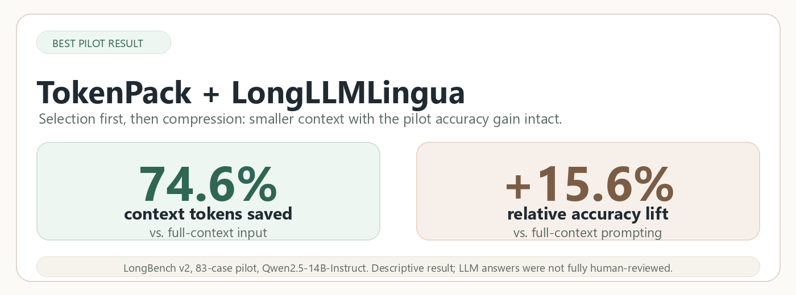
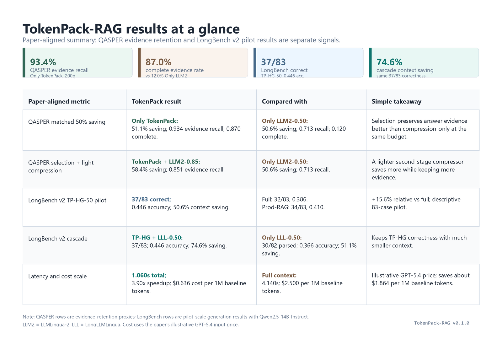

<h1 align="center">TokenPack-RAG</h1>

<p align="center">
  <strong>Turn long files into compact, evidence-dense LLM context.</strong>
</p>

<p align="center">
  <a href="https://pypi.org/project/tokenpack-rag/"></a>
  <a href="https://pypi.org/project/tokenpack-rag/"></a>
  <a href="https://github.com/mo-tunn/TokenPack/actions/workflows/tests.yml"></a>
  
  <a href="https://pypi.org/project/tokenpack-rag/"></a>
  
  
  
</p>

TokenPack-RAG selects the most useful parts of documents, code, PDFs, tables, and folders under a strict token budget. It does **not** call an LLM during packing: it runs local embeddings, evidence scoring, and budget-aware selection, then writes a Markdown context file you can give to any LLM or agent.

In plain English, TokenPack-RAG does three things:

| Step | What happens |
|---|---|
| **Split intelligently** | Breaks the source into chunks that respect headings, paragraphs, code blocks, and semantic shifts. |
| **Score by evidence value** | Ranks chunks by how useful they look for your query, using semantic similarity, keyword support, document position, and structure signals. |
| **Pack the best context** | Fills your token budget with the highest-value chunks first, avoiding the waste of blindly pasting everything. |

Internally, the default pipeline is:

```text
structure-aware semantic chunks + evidence-hybrid scoring + hybrid-greedy packing
```

<p align="center">
  
</p>

## Why Use It

Long-context LLMs make it tempting to paste everything into the prompt. In practice, that is expensive, slow, and often noisy. Naive RAG has the opposite problem: top-k retrieval can collect locally relevant chunks while missing the best global use of a fixed token budget.

TokenPack-RAG is built for that middle layer:

- Turns a file or folder into a compact, LLM-ready context file with one command.
- Selects globally useful evidence under a token budget instead of blindly taking top-k chunks.
- Reduces redundant or low-utility context before it reaches the LLM.
- Helps agents work with large local workspaces through MCP without uploading everything.
- Supports broad real-world inputs: docs, code, PDFs, HTML, CSV/JSON, and Office files.
- Can optionally run LLMLingua / LongLLMLingua after evidence selection for extra compression.

## Install

Basic install:

```bash
pip install tokenpack-rag
```

Recommended document install:

```bash
pip install "tokenpack-rag[pdf,office,tokens]"
```

Agent/MCP install:

```bash
pip install "tokenpack-rag[mcp,pdf,office,tokens]"
```

Development install:

```bash
git clone https://github.com/mo-tunn/TokenPack.git
cd TokenPack
pip install -e ".[pdf,office,tokens,compression,mcp,dev]"
```

TokenPack-RAG uses `sentence-transformers/all-MiniLM-L6-v2` as the default embedding model. The CLI tries local model files first and prints progress while loading; first-time users may see a Hugging Face download unless they pass `--offline-models`.

## 30-Second Start

Pick the path that matches what you want:

| Goal | Use this | Output |
|---|---|---|
| **Fast default** | Selection-only packing. No LLM call, no prompt-compression model. | `paper-tp.md` |
| **Best combination** | TokenPack selection + LongLLMLingua compression for the strongest current context-saving setup. | smaller `paper-tp.md` |
| **Folder pack** | Pack a whole project or document folder into one context file. | `docs-tp.md` |

**Fast default**

Use this first for most documents:

```bash
tokenpack-rag pack paper.pdf --query "What are the main contributions?"
```

Writes:

```text
paper-tp.md
```

**Best combination**

Use this when you want the most aggressive current setup from the paper-style experiments: select the best evidence first, then compress the selected context with LongLLMLingua.

```bash
tokenpack-rag pack paper.pdf \
  --query "What evidence supports the main claim?" \
  --compress llmlingua \
  --longllmlingua \
  --compression-rate 0.50 \
  --overwrite
```

This is the setup behind the headline result: about **74.6% context-token saving**, **3.90x mean-latency speedup**, and roughly **$1.86 saved per 1M input tokens** at the paper's illustrative GPT-5.4 standard input price of `$2.50 / 1M input tokens`, while retaining TokenPack's **+15.6% relative pilot lift** over full-context prompting. It requires the `compression` extra and a local/cached compression model unless you intentionally add `--allow-download`.

**Folder pack**

Use this for a repo, notes folder, or mixed document set:

```bash
tokenpack-rag pack docs/ --query "Summarize the design decisions in this project."
```

Writes:

```text
docs-tp.md
```

**Manual budget**

Use this when you already know your target context size:

```bash
tokenpack-rag pack paper.pdf \
  --query "What evidence supports the main claim?" \
  --budget 32000 \
  --overwrite
```

The output is a packed Markdown context file, not a modified PDF. You can paste it into a chat model, upload it to your own LLM workflow, or let an agent read it through MCP.

## Results Snapshot

<p align="center">
  
</p>

<details>
<summary>Technical result details behind the summary</summary>

The visual summary mixes two different experiment families, so the table below keeps the source of each number explicit. QASPER rows are evidence-retention proxies, while LongBench rows are exploratory end-to-end multiple-choice generation results.

| Experiment | Paper source | Comparison | Paper-aligned result |
|---|---|---|---|
| QASPER compression comparison | `tab:qasper-compression-comparison` | Only TokenPack vs Only LLMLingua-2 at approximately matched 50% token saving | Only TokenPack saves **51.1%** of tokens and keeps **0.934** evidence recall with **0.870** complete-evidence rate. Only LLMLingua-2 saves **50.6%**, keeps **0.713** evidence recall, and reaches **0.120** complete-evidence rate. |
| QASPER selection + lighter compression | `tab:qasper-compression-frontier` | TokenPack followed by LLMLingua-2 at rate 0.85 vs Only LLMLingua-2 at rate 0.50 | TokenPack + LLMLingua-2 rate 0.85 saves **58.4%** of tokens while keeping **0.851** evidence recall. This is more saving and higher evidence recall than Only LLMLingua-2 at 50.6% saving and 0.713 recall. |
| QASPER aggressive compression caveat | `tab:qasper-compression-frontier` | TokenPack followed by LLMLingua-2 at rate 0.50 | The aggressive QASPER compression row saves **75.9%**, but evidence recall falls to **0.632** and complete-evidence rate to **0.035**. That is not the main evidence-preservation headline. |
| QASPER budgeted selection proxy | `tab:qasper-cost-quality` | TP-HG at 50%, 70%, and 80% budgets against the 100% high-budget RAG reference | TP-HG retains **0.930** evidence recall at **51.0%** saving, **0.978** at **31.2%** saving, and **0.989** at **21.3%** saving. These are retrieval-side retention proxies, not generated-answer scores. |
| LongBench v2 pilot accuracy | `tab:longbench-generation` | TP-HG-50 vs full-context prompting and production-RAG-50 | On **83** eligible LongBench v2 cases with Qwen/Qwen2.5-14B-Instruct, full context answers **32/83** correctly (**0.386**), production-RAG-50 answers **34/83** (**0.410**), and TP-HG-50 answers **37/83** (**0.446**) while saving **50.6%** context. The relative lift over full context is **+15.6%**. |
| LongBench v2 cascade accuracy | `tab:longbench-generation` | TP-HG-50 + LongLLMLingua-0.50 vs TP-HG-50 | The cascade keeps the same **37/83** correctness and **0.446** accuracy as TP-HG-50, while reducing average context from **8,731** tokens to **4,468** tokens and increasing context saving from **50.6%** to **74.6%**. |
| LongBench v2 latency | `tab:longbench-latency` | Same 83-case pilot, batch size one, excluding Modal cold start/model loading | Full context takes **4.140s** mean total latency. TP-HG-50 takes **2.196s** (**1.89x** speedup). TP-HG-50 + LongLLMLingua-0.50 takes **1.060s** (**3.90x** speedup). |
| Cost-scale illustration | `tab:cost-savings` | 1M baseline-token scenario at the paper's illustrative GPT-5.4 standard input price | Full context costs **$2.500** per 1M baseline input tokens. TP-HG-50 + LongLLMLingua-0.50 reduces the scaled paid-token count to **254,293** and the cost to **$0.636**, saving about **$1.864**. The price assumption comes from the public [OpenAI API pricing](https://openai.com/api/pricing/) page and is only an economic scaling factor. |

Important interpretation notes:

- The QASPER numbers measure whether gold evidence text remains in the selected or compressed context. They do not measure final human-judged answer quality.
- The LongBench v2 numbers are an 83-case descriptive pilot. They are useful operating-point evidence, but not a statistically powered benchmark claim.
- TokenPack is not claimed to make the generator model smarter. The stronger claim is narrower: selection-first packing can keep answer-bearing evidence before optional compression, and that can improve the operating point of a downstream model or compressor.
- The paper does not claim that exact knapsack selection universally beats every retrieval rule. In the current QASPER selector study, the most robust retrieval-side rule is the evidence-hybrid budget-top-k / TP-HG selector, while exact knapsack remains useful for algorithm analysis and budget-feasible optimization.

</details>

The practical takeaway: pack the useful evidence first, then optionally compress it. This is different from blindly compressing the whole retrieved context.

For the full methodology, tables, limitations, and experiment details, read the paper: [`submission/TokenPack-paper.pdf`](submission/TokenPack-paper.pdf).

## Use With Agents / MCP

Run TokenPack-RAG as a local stdio MCP server:

```bash
tokenpack-rag-mcp --workspace /path/to/project
```

Example MCP config:

```json
{
  "mcpServers": {
    "tokenpack-rag": {
      "command": "tokenpack-rag-mcp",
      "args": ["--workspace", "/path/to/project"]
    }
  }
}
```

Or use `uvx` without a permanent install:

```json
{
  "mcpServers": {
    "tokenpack-rag": {
      "command": "uvx",
      "args": [
        "--from",
        "tokenpack-rag[mcp,pdf,office,tokens]",
        "tokenpack-rag-mcp",
        "--workspace",
        "/path/to/project"
      ]
    }
  }
}
```

MCP tools:

| Tool | Purpose |
|---|---|
| `pack_context` | Packs a file or folder into Markdown context and writes the `-tp.md` artifact. |
| `read_packed_context` | Reads a packed context artifact, optionally in slices for large files. |

By default the MCP server can only read and write inside `--workspace`. Use `--allow-any-path` only for trusted local setups.

## Supported Inputs

TokenPack-RAG accepts a single file or a folder. Folder inputs are scanned recursively and unsupported binary/media files are skipped.

| Category | Extensions |
|---|---|
| Text and docs | `.txt`, `.text`, `.md`, `.markdown`, `.rst`, `.adoc`, `.tex`, `.log` |
| PDF | `.pdf` with the `pdf` extra |
| Web | `.html`, `.htm` |
| Data/config | `.json`, `.jsonl`, `.csv`, `.tsv`, `.yaml`, `.yml`, `.toml` |
| Office | `.docx`, `.pptx`, `.xlsx` with the `office` extra |
| Code | `.py`, `.js`, `.jsx`, `.ts`, `.tsx`, `.java`, `.go`, `.rs`, `.c`, `.cpp`, `.cs`, `.php`, `.rb`, `.swift`, `.kt`, `.scala`, `.sh`, `.ps1`, `.sql`, `.css`, `.xml`, and related variants |

## Auto Budget

`--budget` is optional. When omitted, TokenPack-RAG estimates a context budget from the source:

```text
source_tokens = sum(chunk.token_count for chunk in index.chunks)
raw_budget = ceil(source_tokens * 0.50)
budget = clamp(raw_budget, min_budget=1200, max_budget=64000)
reserve_output = min(4000, max(512, int(budget * 0.10)))
selection_budget = budget - reserve_output
```

Example terminal summary:

```text
Source: paper.pdf
Output: paper-tp.md
Source tokens: 142,000
Auto budget: 64,000 tokens (ratio=50%, capped by max-budget)
Reserved for answer: 4,000
Selection budget: 60,000
Selected: 188 chunks / 59,240 tokens
```

Useful controls:

```bash
tokenpack-rag pack paper.pdf --query "..." --budget-ratio 0.35
tokenpack-rag pack paper.pdf --query "..." --max-budget 128000
tokenpack-rag pack paper.pdf --query "..." --reserve-output 2000
```

## Output Files

Default output paths:

| Source | Output |
|---|---|
| `paper.pdf` | `paper-tp.md` |
| `notes.txt` | `notes-tp.md` |
| `docs/` | `docs-tp.md` |

Existing outputs are protected:

```bash
tokenpack-rag pack paper.pdf --query "..."
```

If `paper-tp.md` exists, the command stops. Use:

```bash
tokenpack-rag pack paper.pdf --query "..." --overwrite
tokenpack-rag pack paper.pdf --query "..." --out packed-context.md
```

Internal artifacts go under `.tokenpack/runs/<timestamp>/` unless paths are provided:

```bash
tokenpack-rag pack paper.pdf \
  --query "..." \
  --index-out .tokenpack/paper.index.json \
  --selection-out paper-tp.selection.json
```

The default Markdown is intentionally clean: it keeps the query, source, selected-token summary, and source/page markers, but leaves chunk ids, token counts, and artifact paths out of the LLM context. Use debug output only when you are inspecting the pipeline:

```bash
tokenpack-rag pack paper.pdf --query "..." --output-detail debug
tokenpack-rag pack paper.pdf --query "..." --output-detail none
```

## Optional Compression

TokenPack-RAG is selection-first by default. You can optionally compress the selected evidence:

```bash
tokenpack-rag pack paper.pdf \
  --query "What evidence supports the main claim?" \
  --compress llmlingua \
  --compression-rate 0.85
```

LongLLMLingua-style query-conditioned compression:

```bash
tokenpack-rag pack paper.pdf \
  --query "What evidence supports the main claim?" \
  --compress llmlingua \
  --longllmlingua \
  --compression-rate 0.85
```

By default, compression models are expected to be cached locally. Add `--allow-download` only when you intentionally want Hugging Face downloads during compression.

## Python API

```python
from tokenpack.embeddings import make_embedder
from tokenpack.pipeline import ingest_path
from tokenpack.scoring import score_chunks
from tokenpack.selectors import select_chunks

embedder = make_embedder()
index = ingest_path(
    "README.md",
    ".tokenpack/readme-index.json",
    embedder=embedder,
    chunker_name="structure-aware",
    target_tokens=250,
    min_tokens=40,
    max_tokens=320,
)

query = "How does TokenPack reduce LLM context cost?"
query_embedding = embedder.embed([query])[0]

scored = score_chunks(
    query_embedding,
    index.chunks,
    index.embeddings,
    scoring="evidence-hybrid",
    query_text=query,
    redundancy_penalty=0.35,
)

result = select_chunks(
    scored,
    strategy="budget-top-k",
    budget=3000,
    candidate_pool=250,
)

print(result.used_tokens, [item.chunk.id for item in result.selected])
```

## Advanced CLI

The one-command `pack` workflow is the main user-facing interface. Lower-level commands remain available for experiments and reproducible paper runs.

```bash
tokenpack-rag ingest README.md --index .tokenpack/readme-index.json

tokenpack-rag select \
  --index .tokenpack/readme-index.json \
  --query "How does TokenPack reduce LLM context cost?" \
  --budget 3000 \
  --reserve-output 500 \
  --output .tokenpack/selection.json

tokenpack-rag export-context \
  --selection .tokenpack/selection.json \
  --output .tokenpack/context.txt
```

Defaults:

```text
chunker: structure-aware semantic boundaries
chunk-size-preset: low-budget
scoring: evidence-hybrid
selector: budget-top-k (TokenPack hybrid-greedy)
```

Historical selectors such as `knapsack`, `knapsack-redundancy`, and `semantic-threshold` chunking remain available for ablation work, but the main pipeline is hybrid-greedy.

## Reproduce Paper Runs

LongBench v2 Modal pilot used in the current paper:

```bash
python -m modal run submission/longbench_eval/app.py::build_and_run \
  --output-dir submission/results/longbench_v2_modal_hybrid_greedy_83_latency \
  --limit 83 \
  --source-min-tokens 8000 \
  --source-max-tokens 24000 \
  --max-scanned 503 \
  --model-id Qwen/Qwen2.5-14B-Instruct \
  --batch-size 1 \
  --context-order score-then-source \
  --latency-mode
```

See [`submission/source_code_manifest.md`](submission/source_code_manifest.md) for the full artifact map.

## Repository Layout

```text
src/tokenpack/                     Python package and CLI implementation
tests/                             Unit and smoke tests
assets/                            README visual result assets
examples/                          Small local examples for the CLI
submission/paper/                  LaTeX paper source, tables, figures
submission/experiments/            QASPER, LongBench, compression, and ablation scripts
submission/results/                Paper result artifacts and readouts
submission/longbench_eval/         Modal LongBench v2 generation harness
submission/modal_generation_eval/  Modal QASPER generation/judge harness
```

## Notes

- The default workflow is output-first: create a packed context file and send that file to your own LLM.
- Ollama is not required for `pack`; MCP support is optional and local-first.
- Evidence-hybrid scoring weights are engineering defaults. The paper calls out weight calibration as future work.

## Limitations

- The LLM answer-quality experiments are pilot-scale and were not fully human-reviewed.
- QASPER results primarily measure evidence preservation, not end-to-end human-judged answer quality.
- LongBench v2 results are descriptive pilot results, not a statistically definitive benchmark claim.
- TokenPack-RAG improves context selection, but it cannot recover information that is missing from the source or unreadable after extraction.
- The default scoring weights are engineering defaults; stronger calibration is future work.

## License

TokenPack-RAG is licensed under the Business Source License 1.1. See [`LICENSE`](LICENSE).

## Citation

If you use TokenPack-RAG in research, cite the paper PDF in [`submission/TokenPack-paper.pdf`](submission/TokenPack-paper.pdf). A BibTeX entry will be added when the public preprint is available.
